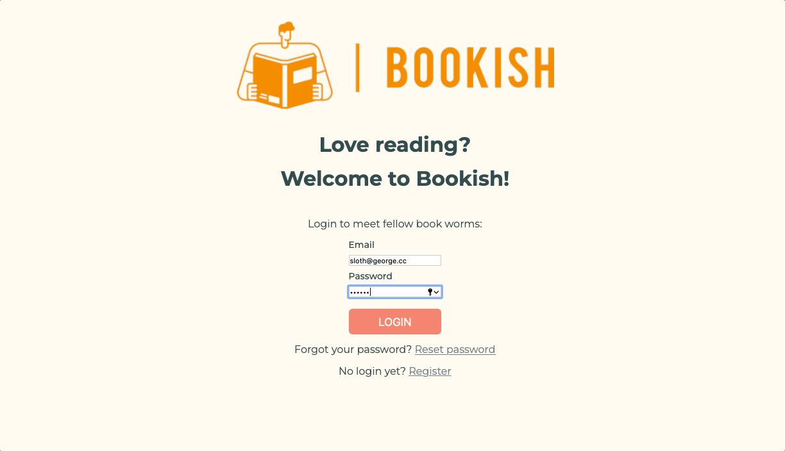
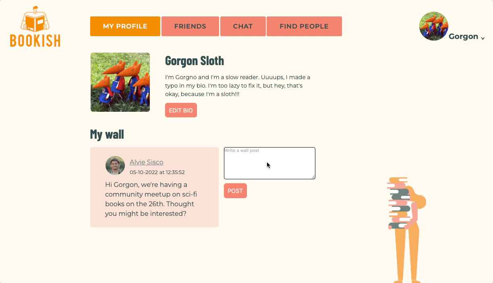

# 📚🐛 Bookish - Social network for book worms

## Live at:

https://bookish-social-network.onrender.com

## Overview

Bookish is an authentication-based SPA with social network functionalities: profile editing, networking, chatting, notifications.

🖥 Optimized for full-screen desktop.

❓ This application was made as a learning project during the full stack bootcamp at Spiced Academy and it was my introduction to all-things React.

## Features

-   Personal profile:

    -   users can upload a profile picture, add/edit their bio
    -   users can view a list of their friends and friend requests

-   Wall posting:

    -   users can add simple text messages to their own and their friends' walls

-   Networking:

    -   users can view a list of the newest users and search through the platform's existing users
    -   users can send, accept & reject friend requests, or unfriend existing friends
    -   users can see the friends of their friends (including friendship status with these)

-   Community chat room with online users:

    -   users can chat in real time
    -   users can view a list of online users which updates in real time

-   Notifications:

    -   users get a notification whenever there is a new friend request (notification persists if user goes offline without having seen it)
    -   users get a notification whenever a friend appears online

-   General functionalities
    -   authenticate/login (with client-side validation)
    -   reset password
    -   logout
    -   delete own account, including all friendship statuses, chat messages, wall posts and uploaded profile pictures

## Technology

-   Javascript
-   A pinch of Typescript
-   React & Redux
-   Node.js & Express
-   PostgreSQL
-   AWS S3 & SES
-   Socket.io

## Set up this project locally

-   you need to own an AWS account with an S3 Bucket as well as SES, and pass AWS credentials so the middleware works
-   pass a recipient email in the `ses.js` file (under "Destination") in this repo to test the password verification functionality
-   set up a PSQL database as described in the `socialnetwork.sql` file in this repo
-   clone the repository
-   install all the dependencies with `npm install`
-   run the project locally with `npm run dev` and open it at `localhost:3000`

## Previews

### Login + own profile + edit bio

 

### Uploading a profile pic

 

### Wall posts

 

### User search

 

### Real-time friendship notifications and managing own friends

 

### Profile of other users

 

### Live chat with list of online users and "friend is online" notification

 

### Delete account preview and logout

 
